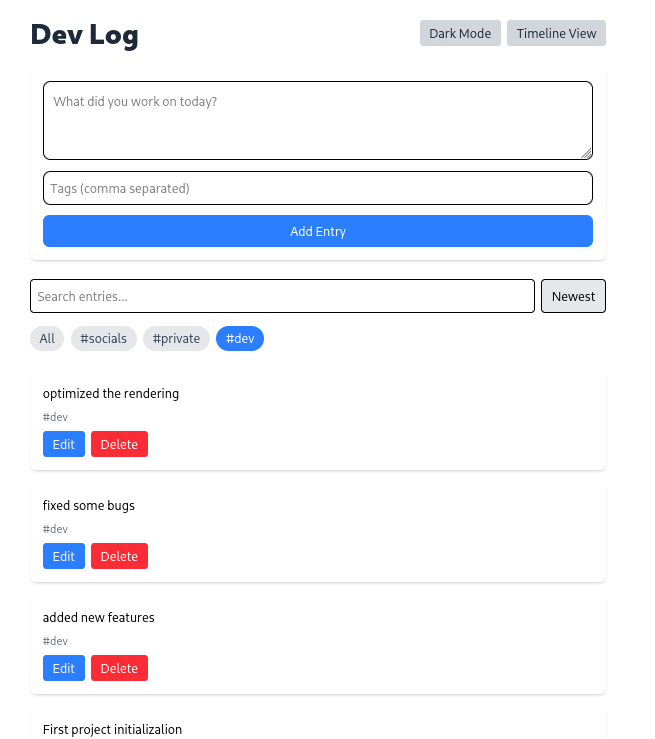

# Dev Log 

A modern **developer logging app** built with **React, TypeScript, Tailwind CSS**, and **Next.js**, showcasing clean architecture, responsive design, and polished UX.

![Dev Log Preview](./assets/overview_timeline_dark.png)
*Screenshot: dark mode with multiple entries and tag filters active*

---

## Live Features

- **Add / Edit / Delete Entries**  
  Quickly log your development tasks with optional tags.  

- **Filter & Search**  
  Search by text or filter by tags. Sort entries by newest or oldest.  

- **Dark / Light Mode Toggle**  
  Toggle themes instantly; your preference is saved for next session.  

- **Smooth Animations**  
  Entries animate on add, delete, and reordering for polished UX.  

- **Keyboard-Friendly UX**  
  - `Ctrl+Enter / Cmd+Enter` submits entries  
  - `Escape` cancels edits  
  - Autofocus on new entry  

- **Persistent Storage**  
  All entries and theme preference saved in `localStorage`.

---

## Tech Highlights

- **Custom Hooks** for centralized state, filters, sorting, and theme.  
- **Memoized Components** (`React.memo`, `useMemo`, `useCallback`) for optimized rendering.  
- **Component-Driven Architecture**: EntryForm, EntryItem, EntryList, TagFilter, SearchBar.  
- **Error Handling & Empty States**: Scoped error boundaries and informative messages.  
- **Tailwind v4 Dark Mode**: Class-based custom variant ensures precise theme control.

---

## Future Improvements

1. **Backend Integration**: Persist entries via API/Database to demonstrate full-stack skills.  
2. **Timeline / Calendar View**: Visualize entries over time for project tracking.  
3. **Advanced UX**: Drag-and-drop, tag animations, offline support via IndexedDB.

---

## Run Locally

```bash
git clone <repo-url>
cd dev-log
npm install
npm run dev
